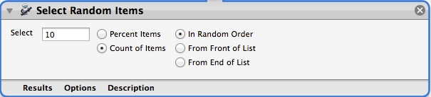
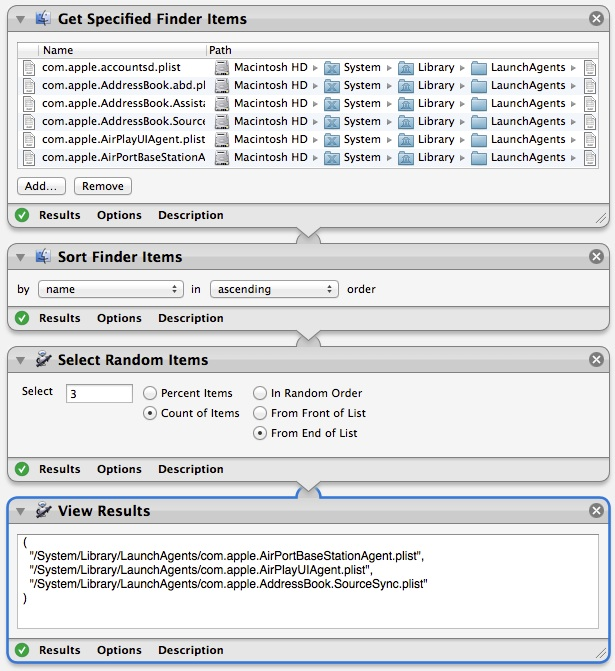

#Select Random Items (Automator Action)

This custom Automator action will select a number of items from an input list and pass those items onto the output list. The number of items to select can be specified as an absolute number or as a percentage. In addition the items can be selected from the front of the list, the back of the list, or randomly from anywhere in the list. Selecting from the either the front or back of the list assumes that the list has been pre-sorted prior to calling this action.

# Installation
Place the **Select Random Items.action** file into one of two locations:

1. /Library/Automator - This will make the automator action available to all users on the computer.

2. ~/Library/Automator - This will make the automator action available to only you.

NOTE: In some newer versions of Mac OSX your *Library* folder is not displayed in the Finder. To display it you can go to the Finder **Go** menu and select **Go to Folder...**, type *~/Library*, and click the **Go** button.

For your convenience, a pre-built action and sample workflow is included in the project's **Sample** directory; otherwise you can build the action yourself.

# Building

To build this project you can use either of the following methods:
* Open the project in Xcode (version 5.1 was used to create the project)
* Run the **build.sh** script from the project directly

# Usage
After you have placed the *.action* file into one of the Library folders as discussed in the *Installation* section above, open Automator to create your workflow.

The **Select Random Item** action can be found in the **Utilities** category.

1. Enter a number of items to select from the previous action's output.
2. Next identify whether the number you just entered refers to the percentage of incoming items or the actual number of items to select.
3. Finally select whether you want to select the items from the front of the list, the end of the list, or randomly throughout the list. 

*NOTE: Selecting from the front or end of the list assumes that a meaningful sort order has already been used on the incoming items.*

Here is a sample workflow showing the action in use:

# Remarks

The action will perform the following internal adjustments on the input values, but these adjustments will not be reflected in the user interface:

* If a negative number is entered, it will be changed to zero.
* If a percentage value greater than 100 is entered, it will be changed to 100.
* If the number entered is greater than then amount of items passed to this action from the previous action, it will be adjusted down to match that number.
* When the percentage value is converted to an actual number of items, the ceiling of the result will be taken. This means that the percentage will always convert to include at least one item from the input.

Copyright (c) 2014 Thomas Chester. This software is licensed under the MIT License.